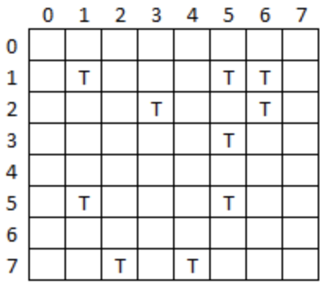

# Tank-Game

This is a coding challenge from my school about arrays in python. Hope you will like it...
I know there are too many lines when you are setting up the game, I am trying to figure out another way to do it. Thank you

Tanks is a game for two players.  At the start of the game, each player places 10 tanks on a board but does not reveal their location to their opponent.  Each tank occupies one square on the board.  Each player takes it in turn to enter a grid reference, e.g. 1,5.  The player destroys the tank if the square is occupied by a tank.  The player to destroy all their opponent’s tanks first wins. 

Example tanks board: 

